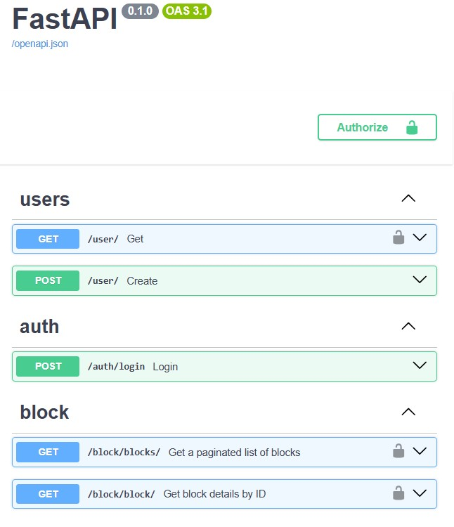
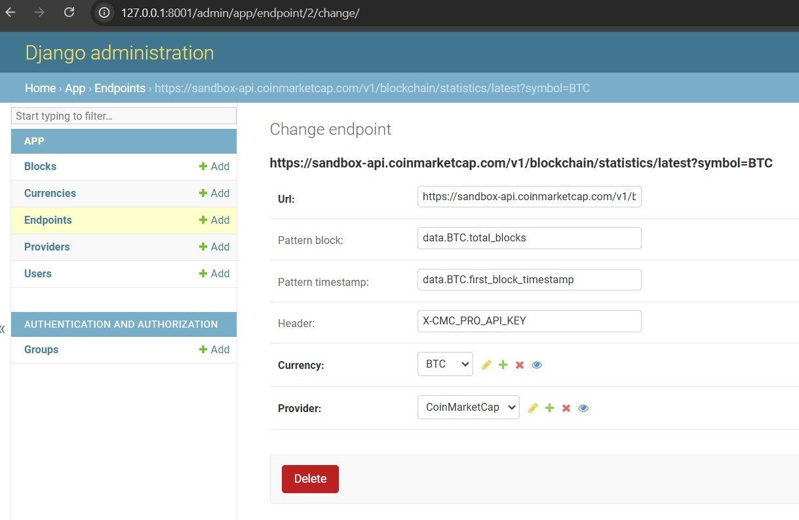

# Crypto app by FastAPI (API) + Django (ORM & Admin) + Celery

## Overview

This application to get (store and show) the latest block for BTC and ETH using
services:

● BTC from CoinMarketCap

● ETH from BlockChair

## Models:

### Currency
   ○ Name

### Provider
   ○ Name

### Endpoint
   ○ FK to Currency

   ○ FK to Provider

   ○ API Key

   ○ Header

   ○ Pattern_block (pattern to get block number from nested dicts)

      * for example: ```Pattern_block = "data.BTC.total_blocks" ``` means data from such json: 
```
      {
          "status":{
               ...
          },
          "data":{
              "BTC":{
                  ...
                  "total_blocks":4528,
                  ...
              }
          }
      }
```

   ○ Pattern_timestamp (pattern to get timestamp from nested dicts)

      * similarly, for example: ```Pattern_timestamp = "data.BTC.first_block_timestamp" ```

### Block
   ○ FK to Currency

   ○ FK to Provider

   ○ Block number

   ○ Created at (when the block was created, if available via API)

   ○ Stored at (when stored info about this block)

## API endpoints

### GET /user/
● Get current user uuid, username, email

### POST /user/
● Create user with username, email, password

### POST /auth/login/
● Login with login, password

### GET /blocks/
● Get a paginated list of recorded blocks with filters by currency name or provider name (partial match) or provider id

### GET /block/
● Get information about specific block be id or currency name and block number

### GET /currencies/
● Get currencies list

### POST /currency/
● Create new currency

### GET /providers/
● Get providers list

### GET /endpoints/
● Get endpoints list

### POST /endpoint/{id|/
● Create new endpoint 

### PATCH /endpoint/{id}/
● Update endpoint

### /docs/
● Openapi documentation

## Periodic Task

#### ● fetch blocks from all endpoints
#### ● once per 1 min
#### ● asynchronous handler
#### ● safely write to DB


## Tech stack
● Python 3.10 / Poetry / httpx / asyncio

● FastAPI  (API)

● Pydantic

● Django  (ORM + admin)

● PostgreSQL

● Celery 

● Redis (as Broker & Backend)

● Flower (tasks monitoring)

● Docker / Docker-compose

## Prerequisites

### Poetry

Dependency management for Python files is done using POETRY.

1. `python -m venv .venv`
1. `source venv/bin/activate`
2. `pip install --upgrade pip` (if needed)
3. `poetry install`

## Usage

1. Clone this repository

   ```sh
    git clone https://github.com/u123dev/crypto_fastapi_django_celery.git
    ```

1. Create `fastapi.env` with reference to `fastapi.env.sample`

1. Build

    ```sh
    docker-compose build
    ```

1. Dependency install

    ```sh
    docker-compose run --rm fastapi poetry install
    ```

1. Setup Static Files

    ```sh
    docker-compose run --rm fastapi poetry run python manage.py collectstatic --noinput
    ```

1. Migrate

    ```sh
    docker-compose run --rm fastapi poetry run python manage.py migrate
    ```

1. Create SuperUser for Admin 

    ```sh
    docker-compose run --rm fastapi poetry run python manage.py createsuperuser
    ```
1. Load initial data 

    ```sh
    docker-compose run --rm fastapi poetry run python manage.py loaddata init_data.json
    ```
   
1. Start Server

    ```sh
    docker-compose up
    ```
1. API Access

   - [http://127.0.0.1:8000/docs/](http://127.0.0.1:8000/docs/)

1. Admin Panel Access

   - [http://127.0.0.1:8001/admin/](http://127.0.0.1:8001/admin/)

2. Access Flower / Celery tasks monitoring:
   - [http://127.0.0.1:5555/](http://127.0.0.1:8000/5555/)

## DEMO






### Contact
Feel free to contact: u123@ua.fm
